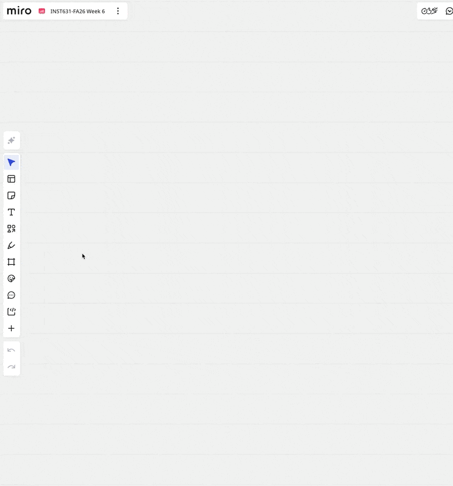
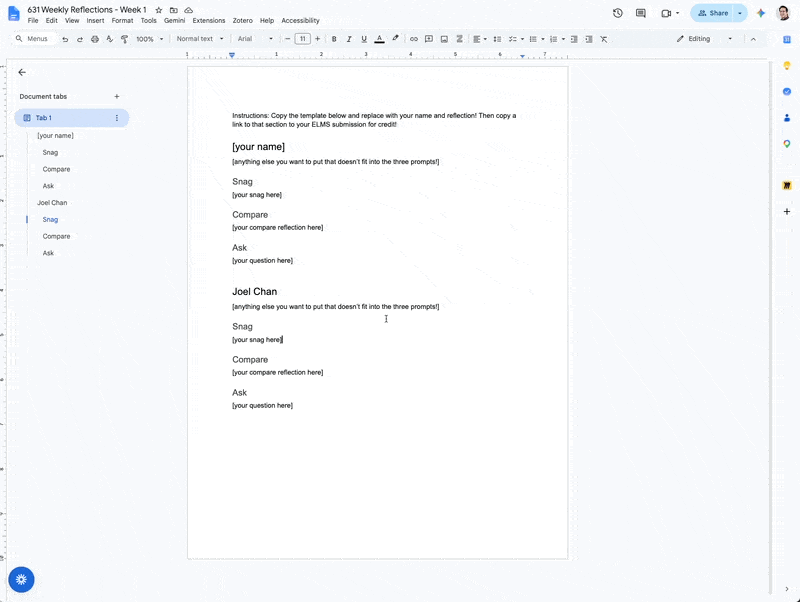

# Where your work goes

**Everything you hand in is a link.** You never upload a file. Your work lives somewhere the rest of us can reach it, and ELMS just points at it.

| | lives on | you hand in | due |
| --- | --- | --- | --- |
| 🃏 **PLAY** | that week's **Miro board** | a link to your frame | midnight the night before class |
| ✍️ **Reflection** | that week's **Google Doc** | a link to your heading | midnight the night before class |
| 🎯 **Mission part** | **your own doc**, in that mission's shared Drive folder | a link to that part's heading | by class time on the due week |
| ⭐ **CYO** | the shared **CYO doc** | a link to your heading | whenever you do one |

Each of those has its own assignment on ELMS. The board and the doc for each week are posted at the start of the week; each mission page links its own shared folder.

!!! tip "There are only two tricks to learn"

    How to link a **frame in Miro**, and how to link a **heading in Google Docs**. That second one covers three of the four rows above, so once you've done a reflection you already know how to hand in a mission and a CYO.

---

## Your PLAY → the week's Miro board

Everything to the right of the marked line is yours to use.

1. **Make a frame** and drop your work inside it. (Frame is the tool in the left toolbar — it's the one that looks like a rectangle with corners.)
2. **Name the frame with your name.** Double-click the frame's label, top-left.
3. **Copy the link to your frame**, and paste that into ELMS.

!!! tip "Getting the link"

    Right-click your frame and look for **Copy link to frame**. If you can't spot it, select the frame and check the **⋯** menu on the toolbar that appears.

    Sanity check before you submit: paste the link into a new browser tab. It should open the board *and jump to your frame*. If it opens the board but doesn't move, you've copied the board link rather than the frame link.

**Why a named frame** rather than dropping things loose. It's what gives you a link at all. It puts you in the board's frame list, so I can find your work during stand-ups. And it stops thirty-five people's plays landing on top of each other.

Your play is meant to be **messy and unfinished**. Photograph a paper sketch and drop the photo in — that counts, and most weeks it's the point.

---

## Your reflection → the week's Google Doc

1. **Add a heading with your name**, at the bottom of the doc.
2. **Make it an actual Heading**, not just bold text — *Format → Paragraph styles → Heading 2*. This is what makes it linkable and what puts you in the outline.
3. Write your reflection underneath it.
4. **Copy the link to your heading**, and paste that into ELMS.

!!! tip "Getting the link"

    Right-click on your heading text and look for **Copy link to this heading**. Alternatively open the outline (*View → Show outline*), find your name, and copy the link from there.

    Same sanity check: the link should open the doc *and scroll to your heading*.

---

## Your mission parts → your own doc, in the mission's shared folder

Each mission has **a shared Drive folder**, linked at the top of its page — [CHI Papers Mission](missions/chi-papers.md), [Evaluations and Usability Testing Mission](missions/evaluations-and-usability-testing.md), [Accessibility Testing Mission](missions/accessibility-testing.md). You make **one doc for the whole mission** and hand in a different heading from it each time a part comes due.

1. **Open the folder** from the mission page, and make your doc *inside it* — **New → Google Docs**, from within the folder. If you make it somewhere else and drag it in later, it can end up shared with nobody but you.
2. **Name the doc with your name.** Everyone's work sits side by side in there, so "Untitled document" helps no one.
3. **Put three Headings in it, one per part** — same *Format → Paragraph styles → Heading 2* move as a reflection. Do this at the start, even though the parts are weeks apart.
4. **When a part is due, copy the link to that part's heading** and paste it into that part's assignment on ELMS.

!!! warning "One doc, three submissions"

    The link you hand in for Part 2 is *not* the same as the link you handed in for Part 1 — it's the same document, but a different heading inside it. Handing in the plain document link works, technically, but it drops me at the top of a long file and I have to hunt for the part you meant.

**Planning to add more than a doc?** Screen recordings, a Figma file, a folder of screenshots — make **a folder with your name** in the shared folder instead, and put your doc inside that. Then everything for that mission travels together.

Whatever else you make still needs to be **reachable**. A Loom or Zoom recording, a Figma prototype, a tldraw board — link it from the right heading in your doc, and check the sharing is open to the class before you submit.

---

## Your CYOs → the shared CYO doc

CYOs are the "choose your own" quests: a play you invented, a talk you went to, a conversation with someone doing interesting HCI work, or one of the bonus readings and watches in the [Schedule](schedule.md). Do as many as you like — five of them count toward your grade.

The condition on a CYO is that **you share it back**, and that's **exactly the reflection move**: heading with your name at the bottom, write underneath it, copy the link to your heading, paste it into ELMS. A few sentences and a link is plenty. The only thing that changes is which doc.

Spotted something the rest of us would want to know about — a talk, an event, a tool, a thing you saw that stuck with you? **Put it in the same doc.** That isn't a CYO and doesn't need submitting. It's just useful.

---

## If something breaks

**Don't let a broken link cost you the points.** If the board won't load, the doc won't open, or you can't work out the link at eleven o'clock at night:

- Submit **whatever you have** straight into the ELMS submission comment — a screenshot, a photo, pasted text — and say what went wrong.
- Then sort out the link when you can.

The deadline is firm because I plan the session from your work, not because I want to catch anyone out.

**If a folder or board won't let you in**, that's mine to fix and not yours. Email me, and submit into the comment box in the meantime.

---

## Two things worth knowing

**Everyone can see everyone's.** That's deliberate. We run stand-ups off the board and read each other's reflections in class. Missions are a lot more interesting when you can see how someone else took the same brief. It does mean writing a reflection knowing your classmates will read it. Say what you actually got stuck on anyway: that's the useful part, and everyone else is stuck on something too.

**Links rather than uploads**, because your work needs to live somewhere the rest of us can reach it and build on it. A file uploaded to ELMS is visible to me and nobody else, which is the opposite of what this class is for. It also means your plays stay *images* — last year's were flattened into text by the tool they lived in, and a lot of good work stopped making sense.
